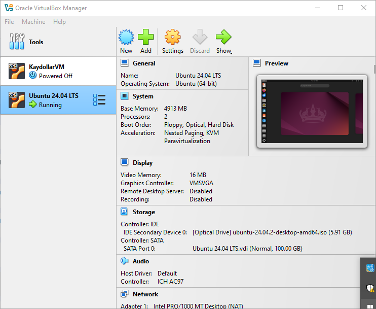

# Visual Studio Setup
## This is my VSCode completed setup

Visual Studio Code, commonly referred to as VS Code, is an integrated development environment developed by Microsoft for Windows, Linux, macOS and web browsers. Features include support for debugging, syntax highlighting, intelligent code completion, snippets, code refactoring, and embedded version control with Git.

# Git Setup

## This is my Git account setup

Git (/ɡɪt/) is a distributed version control system that tracks versions of files. It is often used to control source code by programmers who are developing software collaboratively.

Git is free and open-source software

# VirtualBox

## This is my VirtualBox account setup

### Oracle VirtualBox is a hosted hypervisor for x86 virtualization developed by Oracle Corporation. VirtualBox was originally created by InnoTek Systemberatung GmbH, which was acquired by Sun Microsystems in 2008, which was in turn acquired by Oracle in 2010

# Ubuntu on VirtualBox Window

## This is my setup of my ubuntu on my virtualbox window.

 Ubuntu is a Linux distribution derived from Debian and composed mostly of free and open-source software. Ubuntu is officially released in multiple editions: Desktop, Server, and Core for Internet of things devices and robots.

# GitHub 

## This is my GitHub account Setup

GitHub is a proprietary developer platform that allows developers to create, store, manage, and share their code. It uses Git to provide distributed version control and GitHub itself provides access control, bug tracking, software feature requests, task management, continuous integration, and wikis for every project.

# Amazon Web Srvices (AWS) Account

## This is the completion of my AWS account.

Amazon Web Services, Inc. is a subsidiary of Amazon that provides on-demand cloud computing platforms and APIs to individuals, companies, and governments, on a metered, pay-as-you-go basis. Clients will often use this in combination with autoscaling.

