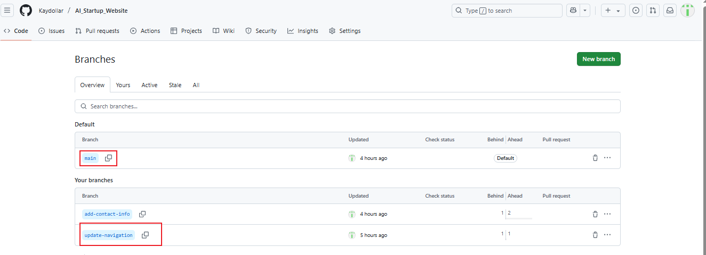

# Git Branching and Merging

## This project focuses on creating Pull Requests (PRs) and merging branches in Git

### Navigating to the GitHub repository

### Switch to the branch

### Create a Pull Request

### Merge the Pull Request

### Updating Jerry's Branch with Latest changes

### Pull Request for Jerry's branch

### Merge Pull Request for Jerry's branch

