# Linux Commands Deep dive
## What are Linux Commands
    Linux commands are textual instructions entered into the Linux terminal (or shell) to perform various tasks. They allow users to manage files, software, system settings, and more, offering a powerful and efficient way to interact with the Linux operating system.

## Structure of Linux Commands
    CommandName [option(s)] [parameter(s)]

A command may consist of options and parameters, but they are not always required: Here are the key components of a commannd.

**CommandName**: This is the name of the program or utility you want to execute, like ls (list files), cd (change directory), or mkdir (make directory). 

It's the core instruction that tells the system what action to perform. 

**Options (Flags)**: 
These modify how the command works, often denoted by a hyphen (-) followed by a single letter or a combination of letters. 

For example, ls -l lists files in a long format, including permissions and file sizes. 

Some options might take values as well, such as grep -n "search_term" filename. 

**Arguments**:
Arguments provide the command with specific data or information to work with, such as filenames, directory paths, or other inputs. 

For instance, cd /home/user/documents changes the current directory to the specified path. 

Some commands might require one or more arguments. 

**_NB_**. Its important to note that Linux commands are case sensitive, so you need to enter them exactly as they are spelled and formatted.

## Manipulating files and directories on linux
    In Linux, manipulating files and directories primarily involves using command-line tools. Key commands for these tasks include cp (copy), mv (move/rename), rm (remove), mkdir (create directory), rmdir (remove empty directory), touch (create file or update timestamp), and ln (create links). 
## The Sudo Commands
    In Linux, the sudo command allows users to temporarily execute commands with elevated privileges, typically those of the root user, without logging in as the root user. It stands for "superuser do" or "substitute user, do," and is a crucial tool for system administration. 
### Functionality:
    Elevated Privileges:
sudo enables users to run specific commands as another user, most commonly the root user, without needing to switch to that user's account entirely. 

    Security:
It provides a secure way to delegate administrative tasks to users without giving them permanent root access. 

    Logging:
sudo logs all commands and arguments executed with elevated privileges, allowing administrators to track and audit user actions. 

    Configuration:
The sudo command's behavior and access control are defined in the /etc/sudoers file. 
 ## Usage:
    1. Syntax:
The basic syntax is sudo command [options] [arguments]. 

    2. Example:
To install a package using the package manager (e.g., apt-get), a user would type sudo apt-get install <package_name>

    3. Password Prompt:
When using sudo, the user will be prompted to enter their own password (not the root password). 

    4. Temporary Privileges:
After executing the command, the user reverts to their normal user privileges. 

## Why use sudo?
    Security:
It avoids the need for users to constantly log in as root, which can be a security risk. 

    Convenience:
It allows users to perform administrative tasks without switching to the root user or requiring a root password. 

    Control:
Administrators can precisely control which users or groups have sudo access and which commands they can execute, according to Red Hat. 
## Creating Foldr with sudo
1. Open your terminal, and connect to your linux server using SSH

2. When you create a directory in a restrited area, you will get a "permission denied" error

3. Use sudo to successfully create the Folder

Verify the folder created by using the command sudo ls /root

## Pwd Command
    The pwd command stands for "print working directory". It is used to display the current directory you are in within the command line interface. This is useful for understanding your current location in the file system hierarchy.

    To use the pwd command, simply type pwd in the terminal and press Enter.
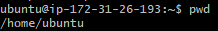
## cd Command
    The cd command stands for "change directory". It is used to navigate between directories in the file system. You can use it to move to a specific directory or go back to the previous one.

    To change to a specific directory(root director "/", use sudo), type sudo cd followed by the path of the directory you want to navigate to.
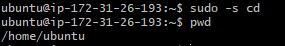

## ls Command
    To list the files and directories in the current directory, you can use the sudo ls -l command.
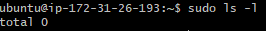

## Side Hustle 1.
1. Create a directory called photos inside the /usr directory.

2. Navigate into the 'photos' directory

3. Create 3 more random directories inside the 'photos' directory.

4. Show the newly created directories on the terminal

5. Navigate into one of them
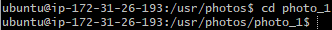
6. Show the full path where you currently are on the screen
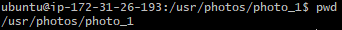

## ls Command
    The ls command is used to list the contents of a directory. It displays the files and subdirectories within the current directory or a specified directory. The ls command has various options that can be used to customize the output, such as showing hidden files, displaying file sizes, and more.
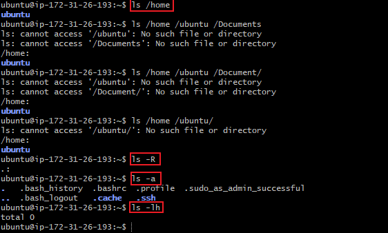
## cat Command
    'Concatenate', or cat, is one of the most frequently used Linux commands. It lists, combines, and writes file content to the standard output (i.e to the terminal console). To run the cat command, type cat followed by the file name and its extension. For example:

## cp Command
    Use the cpcommand to copy files or directories and their content from one location to another.

    To copy a file, use the cp command followed by the source file and the destination directory
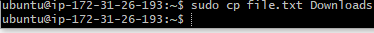

## To copy multiple files into a directory

    

## To copy and entire directory
    use the command cp -r to copy files in one directory to another

## mv Command
    The mv command is used to move or rename files and directories in Linux. It allows you to change the location of a file or directory or rename it without creating a copy.

    To move a file, use the mv command followed by the source file and the destination directory.
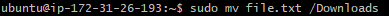

## Rename a file
    You can use the command "mv" to rename a file.

    To rename a file, use the mv command followed by the current file name and the new file name.
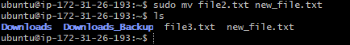

## Remove command
    The rm command is used to remove files and directories in Linux. It allows you to delete files and directories permanently.

    To remove a file, use the rm command followed by the file name.

    NB: This is a very dangerous command, has it deletes the file or directory completely. so must be usd with care.

### To remove a single file
    rm file.txt

### To remove multiple file
    rm file1.txt file2.txt file3.txt

### Options to add for cautions
    -i prompts system confirmation before deleting a file. (Denotes "interractive")

    -f allows the system to remove without a confirmation. (Denotes "force")

    -r deletes files and directories recursively.

## touch Command
    The touch command is used to create empty files.

    To create an empty file, use the touch command followed by the file name.
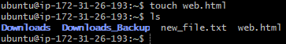
## find Command
    The find command is used to search for files and directories in a specified location. It allows you to search for files based on various criteria, such as name, type, size, and more.

    To find a file by name, use the find command followed by the directory to search in and the -name option with the file name.
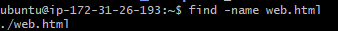

