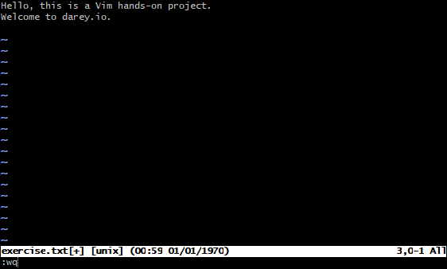

# Linux Text Editors
    Linux text editors are software tools used to create, edit, and manage text files. They are essential for tasks like writing code, scripting, and configuring system settings. Linux offers a wide range of text editors, both command-line-based and graphical, each with its own strengths and features

**Common Linux Text Editors**:
    
    Vi (and Vim):
    Vi is the original, command-line text editor, while Vim (Vi Improved) is its more advanced and feature-rich successor. They are known for their keyboard-centric approach and power, making them popular among experienced Linux users and developers. 

    Emacs:
    Emacs is another powerful, highly customizable text editor with extensive features and the ability to integrate with various tools. It is known for its extensibility and customization options. 

    Nano:
    Nano is a simpler, user-friendly text editor that is often favored by beginners or those who prefer a more straightforward interface. It provides basic editing features and is easily accessible from the command line. 

    Gedit:
    Gedit is a graphical text editor that is part of the GNOME desktop environment. It offers a visual interface and is often preferred by users who prefer a GUI over a command-line editor. 

    Other GUI editors:
    Besides Gedit, other graphical editors like Kate (KDE), COSMIC Text Editor, and Sublime Text are also available and offer a more visual and feature-rich editing experience.

**Key Differences between Editors:**
   
    Command-line vs. Graphical:
    Command-line editors (like Vi, Vim, and Nano) operate within the terminal, while graphical editors (like Gedit and others) have a window-based interface. 

    Complexity:
    Vim(Vi) and Emacs are more complex and powerful, offering a wider range of features and customization options. Nano is simpler and easier to learn, while graphical editors offer a more intuitive user experience. 

**Use cases:**
    
    Command-line editors are often preferred for tasks that involve editing configuration files or for working within the terminal environment. Graphical editors are more suitable for tasks that involve creating and editing documents or for users who prefer a visual interface. 

## Vim Text Editor
    Vim is a highly configurable text editor built to enable efficient text editing. It is an improved version of the vi editor distributed with most UNIX systems.

    
    The Linux Vim text editor, short for "Vi Improved," is a powerful and versatile text editing tool deeply ingrained in the Unix and Linux ecosystems. Vim builds upon the foundation of the original Vi editor, offering an extensive set of features, modes, and commands that empower users to manipulate text efficiently. While Vim has a steeper learning curve compared to simpler editors like Nano, its capabilities make it a favourite among tech professionals and anyone working extensively with text files.

**Installation**
    To install Vim on your Linux system, you can use the package manager specific to your distribution. Here are the commands for some popular distributions:

    sudo apt update
    sudo apt install vim

**Working with Vim**

    Open a new file named example.txt in Vim:

**Saving the file and exit Vim:**

## Basic Commands in Vim:
**Saving a File**: In Normal Mode, type `:w` and press Enter to save the file.

**Exiting Vim**: In Normal Mode, type `:q` and press Enter to quit Vim. If you have unsaved changes, you’ll need to use `:q!` to force quit.

**Saving and Quitting**: To save and quit in one command, type `:wq` and press Enter.

## Navigating in Vim:

**Moving the Cursor**: Use the arrow keys or `h`, `j`, `k`, `l` keys to move left, down, up, and right respectively.

**Jumping to the Beginning or End of a Line**: Press `0` to jump to the beginning of a line and $ to jump to the end.

**Jumping to a Specific Line**: Type `:<line_number>` and press Enter to jump to a specific line.

## Deletion Commands in Vim:
Always use the Esc key to go into normal mode and use the insertion, deletion keys, and other keys. 

To delete the word move the cursor to the beginning of the word and use `:<dw>` command in normal mode. The word under the cursor will be deleted.

To delete more than one word in a single line use the following command.
   
    dw

To delete 2 words use the `:<dw>` command

    dw2

To delete the line move cursor to the beginning of the line and use `:<d$>` command in normal mode. The line under the cursor will be deleted.

    d$
Undo and Redo:
As we are programmers most time we are using undo and redo .vim to provide these to both features in it. To undo press `:<u>` key in normal mode

    u
To redo use the `:<ctrl+r>` key in normal mode in vim

    ctrl+r
check for more details on vim via: https://www.geeksforgeeks.org/getting-started-with-vim-editor-in-linux/

## Nano Text Editor

    Nano is a simple, user-friendly text editor for Unix-like operating systems. It is designed to be easy to use, making it an excellent choice for beginners and those who prefer a straightforward editing experience. Nano provides a terminal-based interface with basic text editing features, allowing users to create and modify files quickly.

**Working with Nano Editor**

Nano is a simple, command-line text editor for Linux, designed to be user-friendly and easy to learn. It's often used for quick edits, creating configuration files, or writing scripts directly in the terminal. Many Linux distributions include Nano pre-installed, making it readily available for users. 

**Key Features and Usage**:

Simple Interface:

    Nano provides a straightforward interface with a function-based navigation menu and keyboard shortcuts, making it easier to navigate and edit files. 
Pre-installed:

    Most Linux distributions include Nano, so users don't need to install it separately, says Hostinger. 
User-Friendly:

    Its simplicity and ease of use make it a good choice for beginners and experienced users alike. 
Essential Editing:
    
    Nano offers essential editing features, including creating, opening, and modifying files. 
Command-line:

    Nano is a command-line text editor, meaning it's used through the terminal. 
Keyboard Navigation:

    Nano relies on keyboard shortcuts for navigation and editing, similar to other command-line editors like Vultr Docs says. 
Open and Edit:
    
    You can open an existing file or create a new one using the command nano filename. 
Saving:
    
    To save your changes, press Ctrl+O, type the filename when prompted, and press Enter to confirm. 
Exiting:
    
    To exit Nano, press Ctrl+X. 
Help:
    
    For help with Nano commands, press Ctrl+G. 
   
Example Usage:
1. Open a new or existing file: nano my_file.txt

2. Start typing to edit the file.

3. Use arrow keys, Ctrl+A (beginning of line), Ctrl+E (end of line), and other shortcuts for navigation.
4. Save the file: Ctrl+O.

5. Exit Nano: Ctrl+X. 

**Displaying saved file**

For more information kindly ref:
https://www.geeksforgeeks.org/nano-text-editor-in-linux/

