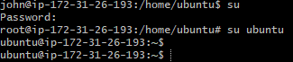

# Advanced Linux Commands
## File Permissions and Access Rights
### chmod command
    The chmod command allows you to modify file permissions. You can use both symbolic and numeric representations to assign permissions to the user, group, and others.

### How it works
1. Create an empty file:

2. Check the file permissions:

3. Update the file permissions using chmod:

4. Using the numeric representation:

### chown command
    The chown command allows you to change the ownership of files, directories, or symbolic links to a specified username or group.

1. Create a User

2. Grant the user sudo privileges:

3. Switch to the new user:

4. Modify user account, by changing user's password:

5. Switch between users:

6. Create a group:

7. Verify the group:

8. Add the user to the group and verify:

9. Change group ownership of a directory:

## Side Task
    Create a group on the server and name it devops

**Create 5 users ["mary", "mohammed", "ravi","tunji", "sofia" ], and ensure each user belong to the devops group**

**Create a folder for each user in the /home directory. For example /home/mary**

**Ensure that the group ownership of each created folder belongs to "devops"**

**Verify the group ownership of each created folder belongs to "devops"**

