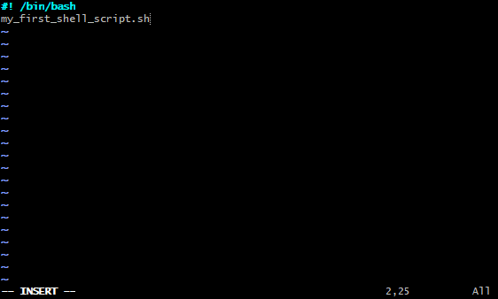
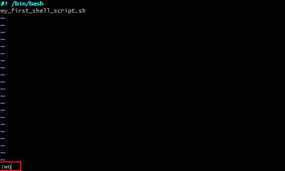
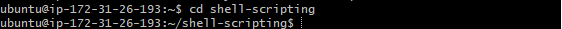
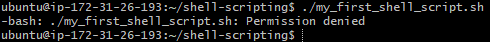
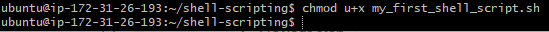
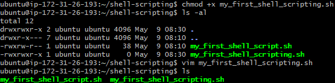

# SHELL SCRIPTING
    A shell is a special user program that provides an interface for the user to use operating system services. Shell accepts human-readable commands from users and converts them into something which the kernel can understand. It is a command language interpreter that executes commands read from input devices such as keyboards or from files. The shell gets started when the user logs in or starts the terminal.
Shell is broadly classified into two categories:
1. Command Line Shell
2. Graphical shell

There are several shells are available for Linux systems like:

    BASH (Bourne Again SHell) – It is the most widely used shell in Linux systems. It is used as default login shell in Linux systems and in macOS. It can also be installed on Windows OS.

    CSH (C SHell) – The C shell’s syntax and its usage are very similar to the C programming language.

    KSH (Korn SHell) – The Korn Shell was also the base for the POSIX Shell standard specifications etc.

Each shell does the same job but understands different commands and provides different built-in functions.

# Task 1
1. Create folder on an ubuntu server and name it shell sscripting

2. Use  **vim** editor, Create a file called my_first_shell_script.sh

3. Save the file using `:wq`

4. Use `cd` to change in the directory **shell-scripting**

5. Using `la -latr` command to confirm that the file is created.

## Bash permission denied

## Adding Permission to the user using `chmod u+x` command

Use `ls` command to verify permission

# Task 1
### **Add Excecutive permission to the owner to be able to execute th shell-script**

### **Running the shell-script**

### **Ensuring that 3 folders are created using the `ls` command.**

### **Ensuring that users are created using the `id` command.**

