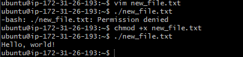
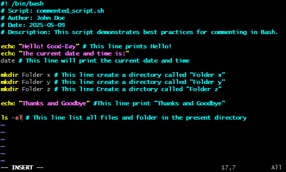

# Bash Script Comments
    Comments are very helpful in documenting the code, and it is a good practice to add them to help others understand the code.

**What are Comments**
    
    Comments are lines in codes that are ignored by the interpreter. in Bash Scripts comments helps documnt the logic and purpose of a code, making it easier to folow and understand the scripts functionally.

**Single Line comments**

    Single line comments in Bash starts with #symbols, everything following this sysmbol on the same line is considered comment and its not executed.

## examples of comments
    # This is an example comment

    # Both of these lines will be ignored by the interpreter

## **Commenting conventions**
File header: Start scripts with a header comment explaining the script's purpose, author, date, and any licensing information.

Function comments: Comment functions, describing their purpose, arguments, and return values.

Inline comments: Use sparingly for complex or non-obvious logic. Avoid stating the obvious.

TODOs: Use TODO: comments to mark areas needing future attention.

Keep it concise: Comments should be brief and to the point.

Update comments: Keep comments synchronized with code changes. 
Outdated comments can be misleading.

Avoid block comments: While technically possible, they can be cumbersome and are not a standard practice.

Comment out code temporarily: Use comments to temporarily disable sections of code during debugging or testing.

Consistent style: Maintain a consistent commenting style throughout your scripts.

# This script will print "Hello, world!"

**echo "Hello, world!" # Prints the greeting**

## Task
**Command `chmod +x` for permission to execute**

**Use of Vim code Editor for Bash**
Use of `Vim` to create and edit 

**commented_script.sh file** 

**Final output on my terminal**

