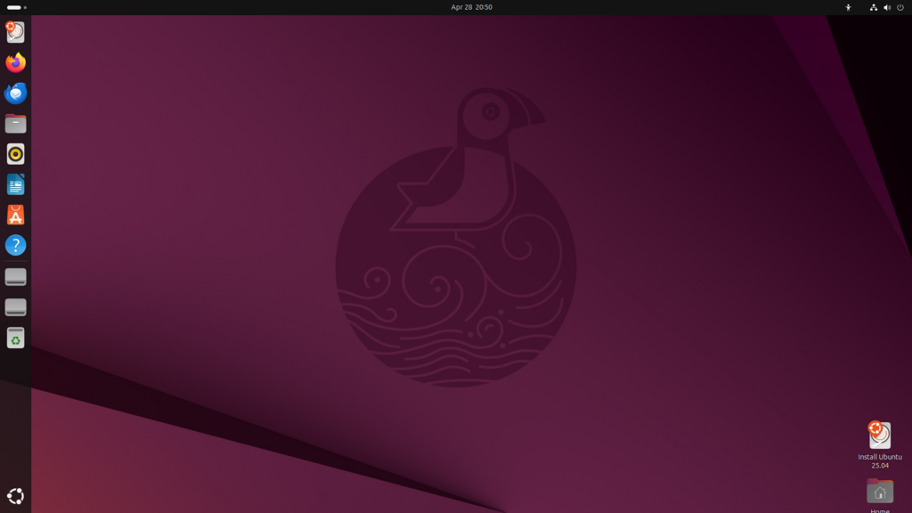
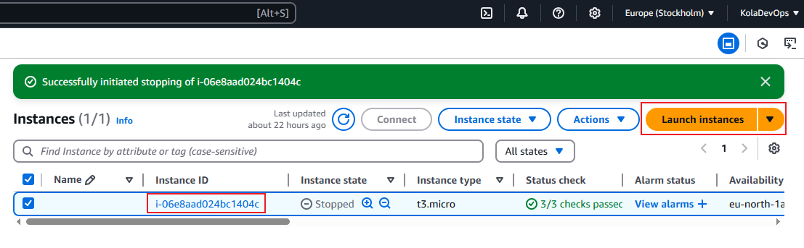
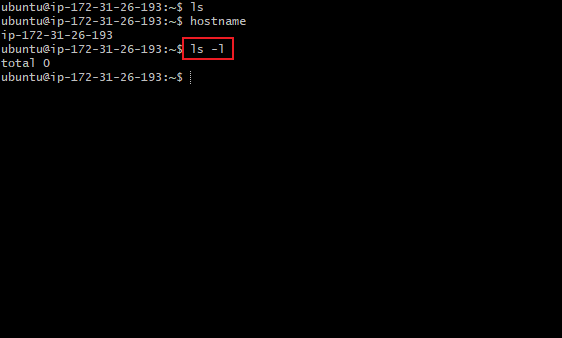

# INTRODUCTION TO LINUX
    Linux is a free, open-source, Unix-like operating system kernel. It's the core of many operating systems, including Ubuntu, Fedora, and Red Hat. Linux is widely used for servers, desktops, mobile devices, and even in embedded systems. 

# What is the difference between Linux and Windows
    Linux is an open-source, free, and versatile operating system, while Windows is a proprietary, commercial operating system known for its user-friendly interface and broad software compatibility

# Ubuntu
    Ubuntu is a popular, free and open-source Linux distribution, often used for both desktop and server environments

EC2 Instance : Linux Server

# Connected to EC2 instance on AWS

# ls -l Command

# Extracting the Public IP created on AWS

# Updating Package List
    Before installing new software or updating existing packages, it is important to update the package list.

    sudo apt update      # For Debian/Ubuntu-based systems

# Installing software Packages
    Installing a command called "Tree"
    
    sudo apt install tree

# Updating install Packages
    sudo apt upgrade

# Removing Software Package
    sudo apt remove tree

    sudo apt install nginx
    

